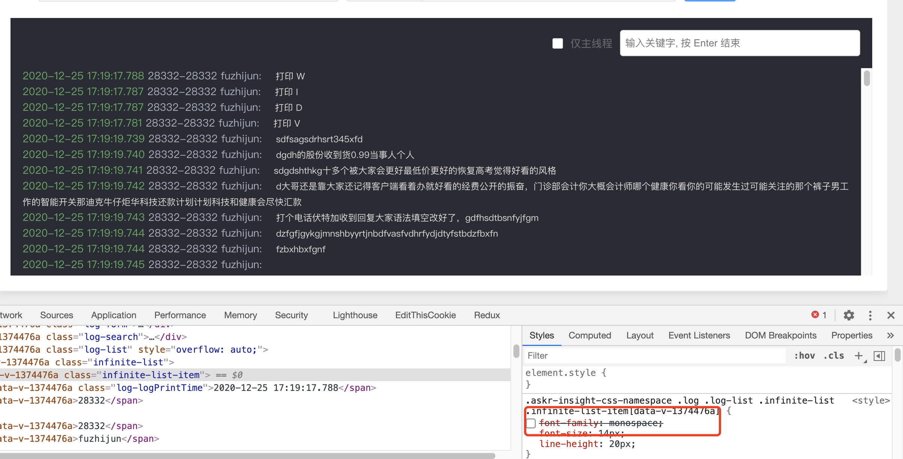
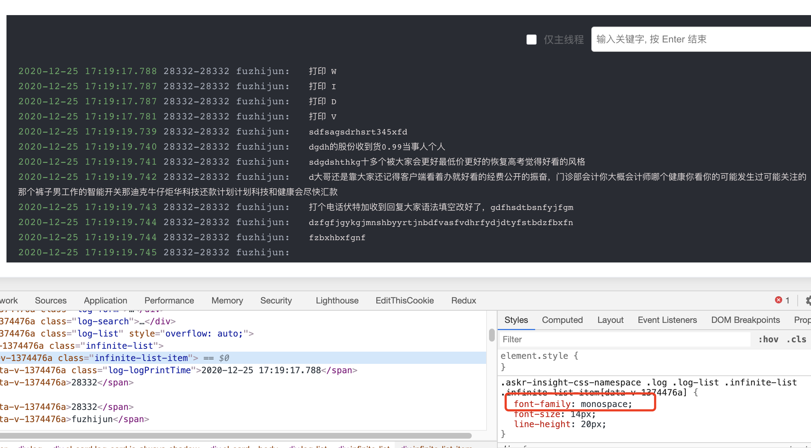

# css等宽字体

> https://juejin.cn/post/6844903872536772616
>
> http://www.ruanyifeng.com/blog/2008/06/typography_notes.html

解决因为字体宽度不同（比如：0 和 9），造成的不对齐的问题

可以采用等宽字体

设置 `font-famliy: monospace` 或者其他的等宽字体就可以实现对齐效果了

- 没采用等宽的排版：
  <!--  -->
  <!--  -->
- 采用等宽字体的排版：
  <!--  -->
  <!--  -->

